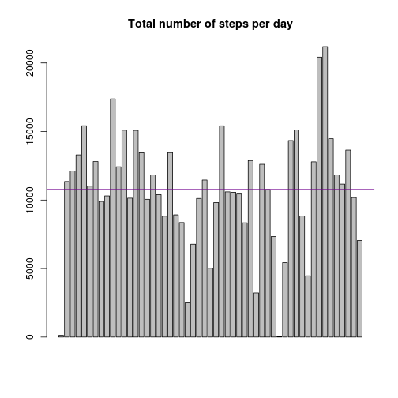

## Loading and preprocessing the data

Since the dataset comes in a zip file (included in the repository), the loading and pre-processing of the data includes the following steps:

1. Unzip the file
2. Load the data using ```read.csv()```
3. Preprocess the data:
    * Pad the interval field with zeroes (e.g. "0005"), for later conversion to a time
    * Join date and (padded) interval/time to produce a valid POSIXct field (```datetime```)
    * Create the "clean" dataset with the number of ```steps```, the ```date``` (as an R date), the ```interval``` (as a factor) and the (POSIXct) ```datetime```
    


```r
unzip("activity.zip")
rawdata <- read.csv("activity.csv")
rawdata$interval <- sprintf("%04d",rawdata$interval)
rawdata$datetime <- as.POSIXlt(paste(rawdata$date,rawdata$interval),format="%Y-%m-%d %H%M")
data <- data.frame(steps = rawdata$steps, date = as.Date(rawdata$date), interval = as.factor(rawdata$interval), datetime = rawdata$datetime)
str(data)
```

```
## 'data.frame':	17568 obs. of  4 variables:
##  $ steps   : int  NA NA NA NA NA NA NA NA NA NA ...
##  $ date    : Date, format: "2012-10-01" "2012-10-01" ...
##  $ interval: Factor w/ 288 levels "0000","0005",..: 1 2 3 4 5 6 7 8 9 10 ...
##  $ datetime: POSIXct, format: "2012-10-01 00:00:00" "2012-10-01 00:05:00" ...
```

## What is mean total number of steps taken per day?

In order to understand this question, we take the following steps:

1. Calculate the sum of steps taken each day (grouping by the ```date``` field of the clean dataset)
2. Draw a histogram of the step values (with a simple barplot, since we already have the aggregate), adding a red line for the mean of daily steps, and a blue one for the median
3. Calculate the exact values of the mean and the median of the step values


```r
ag <- aggregate(steps ~ date,data=data,FUN="sum")
barplot(ag$steps)
abline(mean(ag$steps),0,col="red")
abline(median(ag$steps),0,col="blue")
```

 

```r
mean(ag$steps)
```

```
## [1] 10766
```

```r
median(ag$steps)
```

```
## [1] 10765
```

## What is the average daily activity pattern?

To see the average daily patterns, we:

1. Aggregate the steps data, in this case using the ```interval``` factor and the ```mean``` function
2. We do a line plot of the resulting values
3. We extract the maximum value of this aggregation, to see which is the daily interval of maximum activity


```r
ag2 <- aggregate(steps ~ interval, data=data, FUN="mean")
plot(ag2$interval,ag2$steps,type="n",xlab="Daily intervals", ylab="# of steps", main="Average daily pattern")
lines(ag2$interval,ag2$steps)
```

 

```r
ag2[ag2$steps==max(ag2$steps),"interval"]
```

```
## [1] 0835
## 288 Levels: 0000 0005 0010 0015 0020 0025 0030 0035 0040 0045 0050 ... 2355
```

```r
max(ag2$steps)
```

```
## [1] 206.2
```

## Imputing missing values


## Are there differences in activity patterns between weekdays and weekends?
